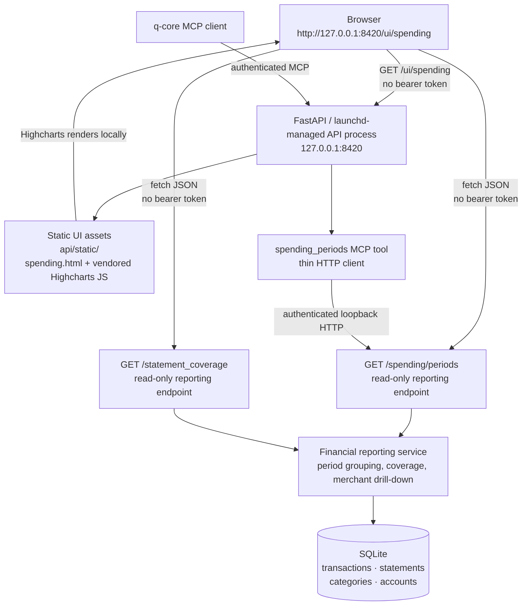

# Spending page architecture

Only `/ui/spending`, `/spending/periods`, and the coverage read endpoint are
exempt from bearer authentication; the exemption is a pinned read-only
allowlist. `/spending/periods` is the single source of truth for the page and
the MCP `spending_periods` tool.
